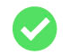

# Auto-seguimiento de mi auto-aprendizaje

En este repositorio comparto el aprendizaje que voy adquiriendo en la plataforma de freecodecamp.
Conozco algunos temas porque ya los he venido trabajando en proyectos, sin embargo,
nunca viene mal un repaso siempre, porque creo que en la repetición, está el gusto, y sobre todo la maravillosa retención 😍 🧠

Y aunque al final te certifican, lo que quiero personalmente, es repetir los temas que aprendí inicialmente para convertirme en frontend developer porque quiero saber que tanto me acuerdo de ellos ahora que ya tengo cierta experiencia y porque además, a medida que voy adquiriendo nuevos skills, siempre retornan, por lo que veo necesario, tener siempre, todo lo que aprendo de manera organizada y recurrir a ellos para actualizarlos y sobretodo compartirlo.

A continuación detallo los skills que re-pasaré a través de esta plataforma

| Habilidad Técnica                        |           1 Subtemas            |                2 Status                 |
| :--------------------------------------- | :--------------------------------: | :----------------------------------------: |
| **Responsive Web Design Certificaction** |       `Basic HTML and html5`       |           |
|                                          |            `Basic CSS`             |           |
|                                          |      `Applied Visual Design`       |         |
|                                          |      `Applied Accessibility`       |         |
|                                          | `Responsive Web Design Principles` |         |
|                                          |           `CSS Flexbox`            |         |
|                                          |             `CSS Grid`             |         |

---
